# Marvel-task

# Task 1: 3D Printer:
 ## Objective:
To understand the working of a 3D printer, learn about STL files, slicing software, and important printer settings.

## Report
In this task, I studied the basic working of a 3D printer using online resources. I learned that 3D printers work on the principle of additive manufacturing, where objects are created layer by layer using materials like PLA or ABS. I understood that an STL file is a 3D model file that contains the shape of the object to be printed.
I studied important printer settings like bed temperature, which helps in proper adhesion of the print to the bed, and infill density, which controls how solid the object is. I also learned about other settings such as  print speed, and nozzle temperature.
Finally, I went through the standard operating procedures (SOPs) for safely using a 3D printer, including proper setup, handling, and maintenance. This task helped me gain a clear understanding of the complete 3D printing process.

# Task 2:API

# Objective

- Understand the concept of an **Application Programming Interface (API)** and how it enables communication between different software systems.
- Study the **working mechanism of APIs**, including request, response, and data exchange.
- Design and develop a **user interface (web or mobile app)** that makes API calls and displays the retrieved data effectively.

API stands for Application Programming Interface.It acts as a bridge between different software applications.
## How an API Works

**The Request:**  
The client sends a message to a URL (the Endpoint). This request has a **Method** like `GET` to get data or `POST` to send data. Usually, it also has an **API Key** for security.  

**Processing:**  
The server gets your request, checks who you are, and looks in its database to find the info you asked for.  

**The Response:**  
The server sends the data back, usually in **JSON**(Java script object notation) format. JSON is just text that is easy for computers to read.

# Task 3 : Git hub
 ## Objective
To learn about GitHub Actions, Issues, and Pull Requests by exploring a given repository.
## Report
In this task, I explored the given GitHub repository and read the README file. I learned how GitHub Actions automate tasks, how Issues are used to track problems, and how Pull Requests are used to make changes. I completed the given tasks and understood basic GitHub workflows.
## Link to my git :
[Link Text](https://github.com/UVCE-Marvel/git-task/pull/284)

# Task 4: Command line on ubuntu
# Objectives

- Create a folder named `test`.
- Change directory into that folder.
- Create a blank file without using any text editor.
- List the files in that folder.
- Create 2600 folders in this folder, where each folder is named like `M90` or `B56`.
  
  # Report
  
- Created a folder named `test`.
- Changed directory into the `test` folder.
- Created a blank file without using any text editor.
- Listed the files in the folder to verify the blank file.
- Created 2600 folders in the folder, each named like `M90` or `B56`.
- 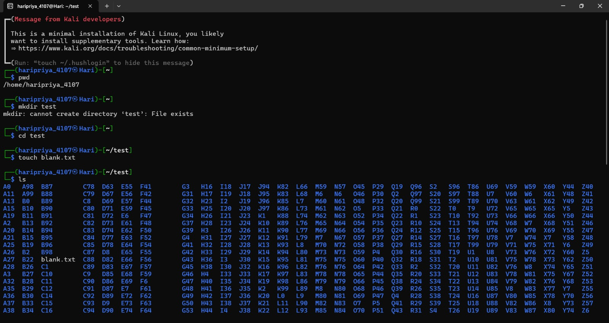
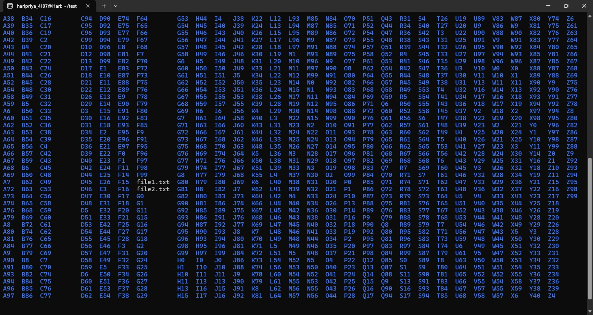
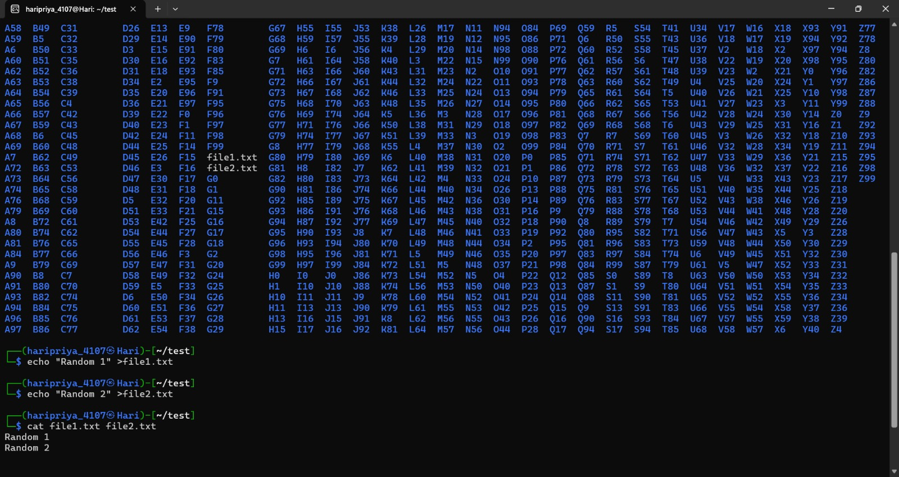

# Task 7:Create a portfolio webpage

I created a simple website using the knowledge I have of **HTML** and **CSS**.  
This project allowed me to practice structuring web pages with HTML and styling them with CSS.  

# Task 8: Writing resource article using markdown
# Objective :
To write a resource article in markdown
# Report :
As part of the assignment, a technical article was written on the topic **"Robotic Dog"** using Markdown. The goal was to understand how Markdown can be used to structure and present technical content clearly without using complex tools or HTML.
# Outcome :
- Successfully created a well-structured technical article using Markdown  
- Gained a better understanding of both Markdown formatting and basic robotics concepts  
- Improved technical writing and documentation skills  
# Link to my article:
[Link Text](https://github.com/haripriyamuniraju07/Robotic-dog)

# Task 9:Tinkercad 

# Objective:
The objective of this task is to design and simulate circuits in Tinkercad that demonstrate the use of an ultrasonic sensor for distance measurement and object detection. 
# Report:
In this task, I learned about Tinkercad, which is an online platform used for 3D design, electronics simulation, and coding. It is beginner-friendly and helps in understanding basic concepts of design and circuits.
I successfully signed up on the Tinkercad platform by creating a new account.And built a simple radar system using an ultrasonic sensor that detects objects and displays distance

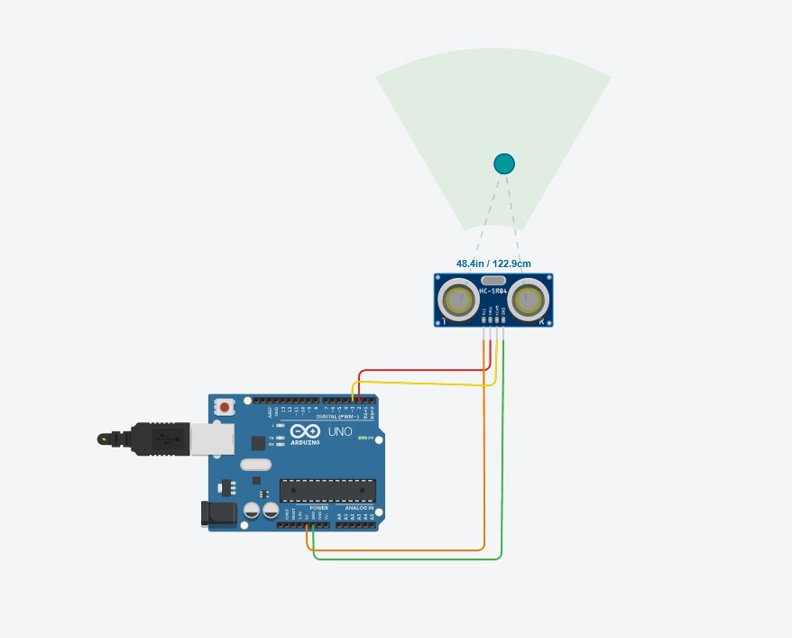

# Task 10: Speed control of DC motor
# Objective:
The objective of this task is to explore and implement basic techniques for controlling DC motors using an Arduino UNO and the L298N H-Bridge motor driver. 
# Report :
 In this task I learnt Basic techniques to control DC motor using L298N motor driver
## 1. Direction Control (H-Bridge)
- Used to rotate motor **forward or backward**
- Achieved using an **H-Bridge circuit** (like L298N)
## **Concept:**
- IN1 HIGH, IN2 LOW → Forward  
- IN1 LOW, IN2 HIGH → Reverse  
- Both same → Stop  
## 2. Speed Control using PWM (Pulse Width Modulation)
- Controls motor speed by varying voltage effectively  
- Done using Arduino PWM pins  
## **Concept:**
- Higher duty cycle(The duty cycle is the percentage of time a signal stays ON (active/high) compared to the total time of one cycle) → Faster motor  
- Lower duty cycle → Slower motor  
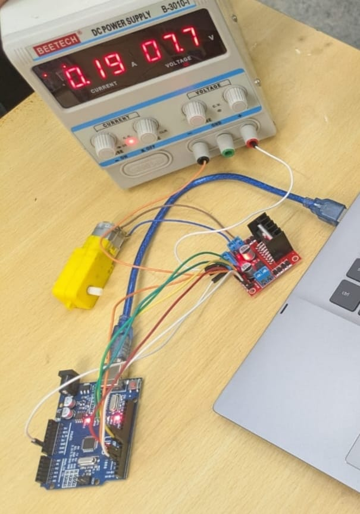
## Components Used
- Arduino UNO
- L298N Motor Driver Module
- DC Motor
- RPS
 ## Working:
- The Arduino sends digital signals to the motor driver.
- The motor driver controls:
  Direction by switching polarity
  Speed using PWM (Pulse Width Modulation)
- The regulated power supply ensures a constant voltage, allowing smooth motor operation.
 
[Click to watch video](./DC_MOTOR.mp4)
# Task 11: LED Toggle using ESP32
# Objective:
To design and implement a standalone web server using the ESP32 microcontroller that allows users to control an LED connected to its GPIO pins through a simple web interface
# Report:
In this task i learnt that- ESP32 is a low-cost microcontroller with built-in Wi-Fi and Bluetooth.
- It has multiple GPIO pins that can be programmed to control LEDs, motors, or sensors.
- The ESP32 can host a web server, which allows me to interact with hardware through a browser.
  The first step was to upload the required code to the ESP32. Then, I entered the mobile hotspot Wi-Fi credentials in the code so that the ESP32 could connect to the network. After uploading the code, the ESP32 generated an IP address. By entering this IP address into a web browser, a web page opened where I could toggle the LEDs on and off.
  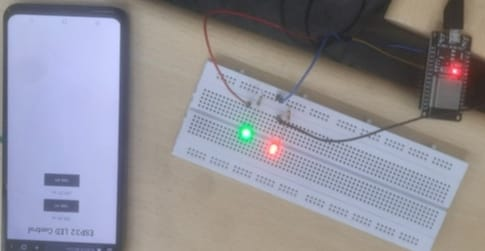

# Task 12 : Soldering
The objective of this task is to gain hands-on familiarity with soldering equipment and techniques by learning the function and safe usage of tools such as solder, soldering iron, soldering wick, and flux.
# Report:

Soldering is the process of joining two or more metal surfaces using a filler metal (called solder) that melts at a lower temperature than the base metals, creating a durable electrical or mechanical bond.I learned about soldering tools such as the soldering iron, solder wire, flux, and soldering wick. Under supervision, I performed basic soldering on a perf board.
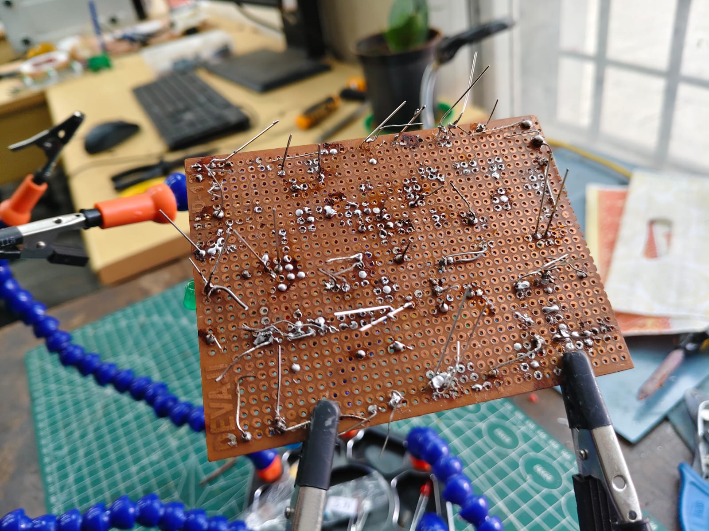
# Task 13: 555
## Objective
To design and implement a 555 timer–based astable multivibrator circuit with a duty cycle of 60%.
## Report:
In this task, a 555 timer IC was used to design an astable multivibrator circuit that generates a continuous square wave output. The circuit was assembled on a breadboard using appropriate values of resistors and a capacitor to achieve a duty cycle close to 60%. The connections were made according to the standard astable configuration .The duty cycle was controlled by selecting suitable resistor values. The circuit functioned successfully, producing a stable waveform with the desired duty cycle. This task helped in understanding the working of the 555 timer in astable mode and its practical applications.
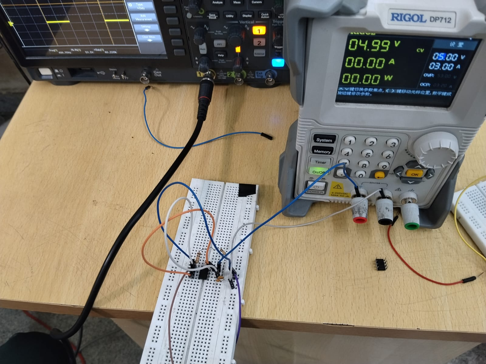
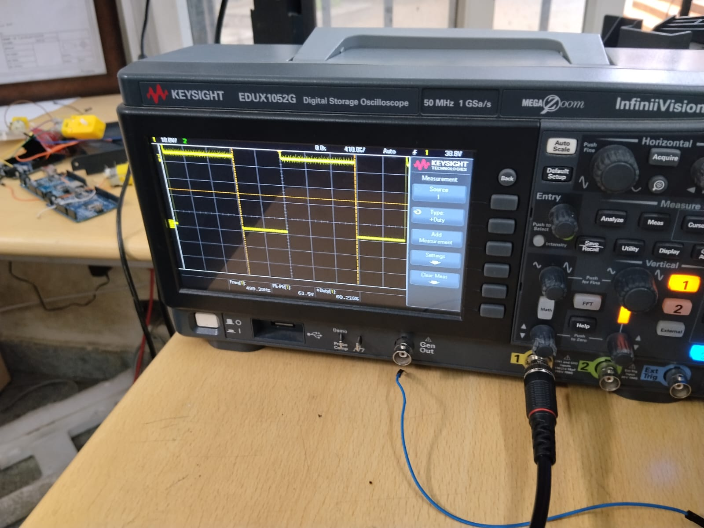

# Task 14: K map
# **Burglar Alarm using Logic Circuits**

## **Objective**
To design a burglar alarm system using logic gates by analyzing door and key conditions using a Karnaugh map.

## **Truth Table**

Let:  
- **D = Door (1 = Open, 0 = Closed)**  
- **K = Key (1 = Pressed, 0 = Not Pressed)**  
- **A = Alarm (1 = ON, 0 = OFF)**  

| D | K | A |
|---|---|---|
| 0 | 0 | 0 |
| 0 | 1 | 0 |
| 1 | 0 | 1 |
| 1 | 1 | 0 |

## **Karnaugh Map**

| D\K | 0 | 1 |
|-----|---|---|
| 0   | 0 | 0 |
| 1   | 1 | 0 |

## **Simplified Expression**

A = D · K̅
## **Report**
In this task, I designed a burglar alarm system using logic gates. I first created a truth table based on door and key conditions. Then, I used a Karnaugh map to simplify the Boolean expression. The simplified result showed that the alarm turns ON only when the door is open and the key is not pressed.  

Using this expression, I built the circuit with an AND gate and a NOT gate. Push buttons were used as inputs for door and key conditions, and an LED or buzzer was used as output. The circuit was tested and worked correctly. This experiment helped me understand how K-maps simplify logic design and their use in real-life applications.

# Task 15 : Active participation:
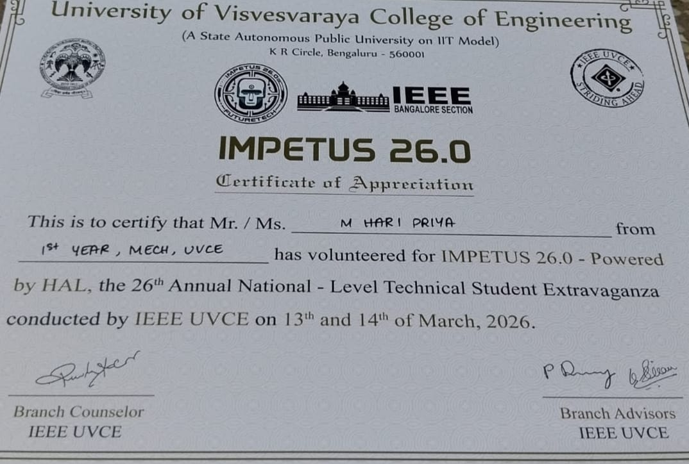

# Task 16: Datasheet Report writing
# L293D Motor Driver

## Objective
To study the datasheet of the L293D motor driver IC and understand its working, internal structure, and concepts such as PWM and H-Bridge used in motor control.
## Introduction
The L293D is a motor driver integrated circuit (IC) used to control DC motors. It acts as an interface between low-power devices like microcontrollers and high-power motors.
It can:
- Control direction of rotation
- Control speed of motors.
## IC Description
The L293D is a **quadruple half-H driver IC**, which means:
- It has 4 driver circuits
- It can control 2 DC motors

### Key Features:
- Operating voltage: 4.5V to 36V
- Output current: up to 600 mA per channel
- Built-in flyback diodes
- Separate logic and motor power supply
## H-Bridge Concept
An H-Bridge is a circuit that allows a motor to rotate in both directions.

### Working:
- Uses 4 switches (S1, S2, S3, S4)
- Different combinations control direction:
  - S1 & S4 ON → Forward rotation
  - S2 & S3 ON → Reverse rotation
In L293D, the H-Bridge is internally implemented.
## PWM (Pulse Width Modulation)
PWM is a method used to control motor speed.
### Working:
- Motor is supplied with pulses instead of constant voltage
- Speed depends on duty cycle:
  - Higher duty cycle → Higher speed
  - Lower duty cycle → Lower speed
In L293D:
- PWM is applied to the Enable pin
## Working of L293D
1. Input pins receive signals from microcontroller
2. Internal H-Bridge processes the signals
3. Output pins drive the motor
4. Enable pin controls motor ON/OFF and speed using PWM.
The L293D motor driver IC simplifies motor control by integrating H-Bridge circuits and supporting PWM for speed control. It is widely used due to its simplicity and effectiveness.
   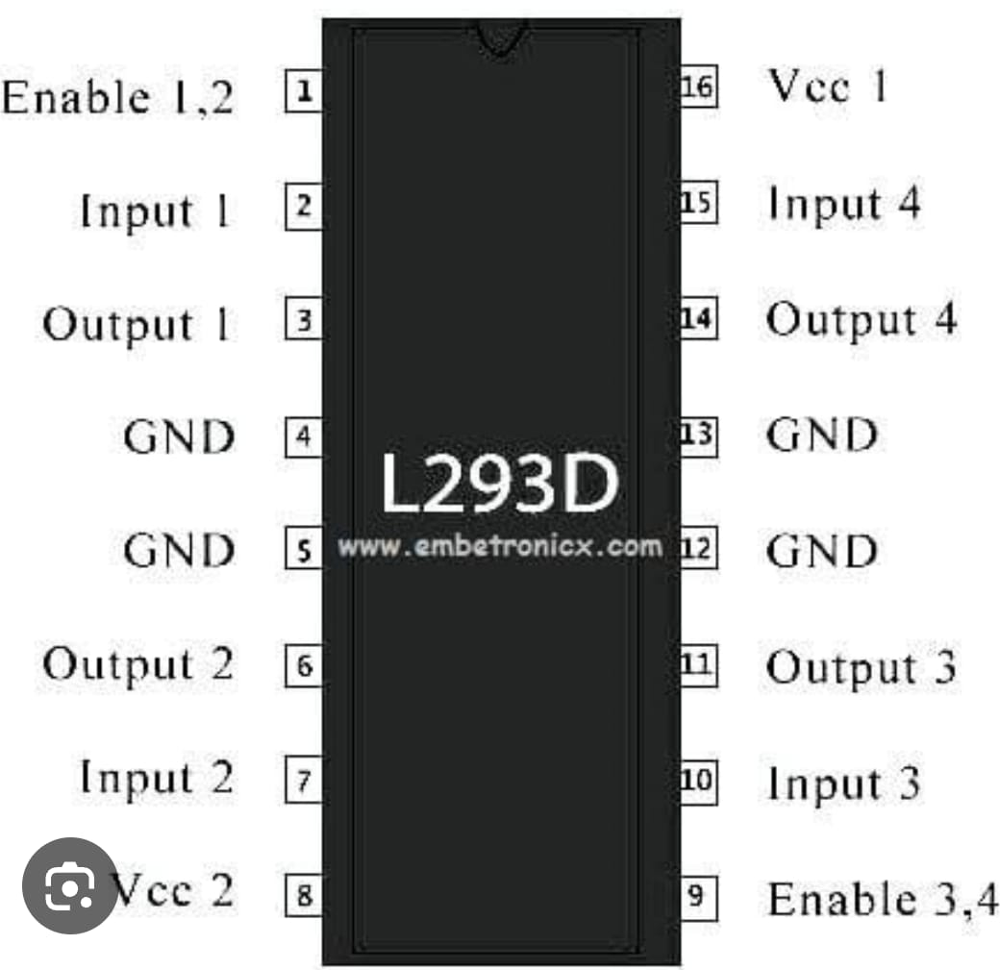
